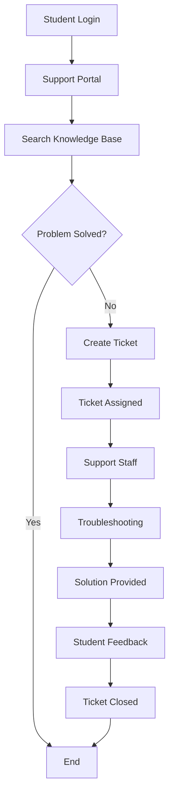

# System Flow Diagram

## Student Support Flow

## Explanation

1. Student logs into the support portal.
2. Student searches the Knowledge Base.
3. If a solution is available, the student solves the problem.
4. If the problem is not solved, a support ticket is created.
5. The ticket is assigned to support staff.
6. Support staff investigates the problem.
7. A solution is provided.
8. The student provides feedback.
9. The ticket is closed.
